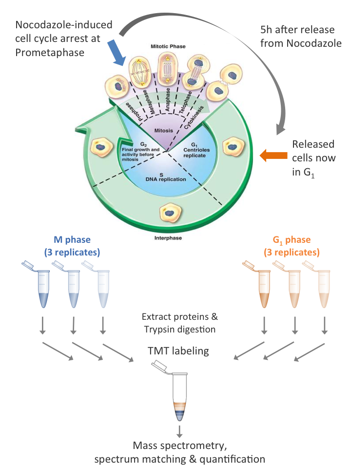

***

**Learning outcomes**

1. Be able to aggregate peptide level data to obtain protein-level quantification.
2. Be able to normalise proteomics data and understand why we perform normalistion.
3. Perform and understand statistical tests to identify changes in protein abundances.
4. Perform a functional analysis to identify the perturbed biological processes

***

## 1. Introduction
This practical analyses data from an experiment to examine proteins involved in the cell cycle (See diagram below). Cells from a human cell line are treated with Nocodazole to inhibit polymerisation of microtubules and block transition beyond the prometaphase stage of M-phase.

Cells are then released from M-phase by withdrawing Nocodazole. Samples are taken in triplicate at 0 hours and at 5 hours after release from M-phase. This process generates 3 x M-phase and 3 x G1-phase samples from 6 separate batches of cells.

To measure protein abundances, proteins are first digested to peptides with trypsin. The same quantity of peptides from each sample was then labelled using Tandem Mass Tags (TMT). This allows all the samples to be combined into a single MS run to yield quantification over the same peptides in each sample. 

The peptide spectrum matching and quantification steps have already been completed and the peptide-level quantification is provided to you.



***
**Check your knowledge**

1. Why does inhibiting polymerisation of microtubles block transition beyond prometaphase?
2. What else might inhibiting polymerisation of microtubules do to the cells?
3. Why do we take experimental triplicates?
4. Why do we digest using trypsin? At which residues does trypsin cleave?
5. What is a tandem mass tag?
6. Why do we process all samples in the same MS run?
7. What is peptide spectrum matching?


***


First, we load the required libraries. If you get a message saying `Error in library(sds) : there is no package called ...`,

temporarily uncomment the neccessary lines to install the package
```{r}
#install.packages("tidyr")
#install.packages("dplyr")
#install.packages("ggplot2")

library(tidyr)
library(dplyr, warn.conflicts = FALSE)
library(ggplot2)

options(width = 60, dplyr.summarise.inform = FALSE)
```

## 2. Preparing the data

### 2a. Loading and reading in the peptide-level quantification

Usually your data is provided to you in some format such as a text file, excel file or some other format. We would like to load this data into R so we can analyse it. 

For the purposes of this practical, peptides which come from proteins in the [cRAP database](http://www.thegpm.org/crap/) of common proteomics contaminates, e.g keratin, have been removed. Peptides which cannot be uniquely assigned to a single protein have also been removed. 

The data is provided here in a tab-separated text file `"data/peptide_data.tsv"`, which is located in the repository. 
We start by reading the peptide-level quantification data into a `dataframe`. The code chunk below loads the data from the .tsv file into an R dataframe called `peptides_quant`.

```{r}
peptides_quant <- read.table("data/peptide_data.tsv", sep = "\t", header = TRUE)
```

If we take a look at the column names (R function `colnames()`) of the `peptides_quant` dataframe, we can see we have 9 columns. The first 3 columns describe the sequence of the peptide, the modifications which were detected and the protein which the peptide has been assigned to. The next 6 columns provide the quantification values for the 3 M-phase and 3 G1-phase samples.

```{r}
print(colnames(peptides_quant))
print(dim(peptides_quant))
print(head(peptides_quant, 5))
```

You'll notice that some of the quantification values of the peptides are "NA".

We can also see that some of the peptides have the same sequence but different modifications. Below, we inspect one such peptide sequence
```{r}
filter(peptides_quant, Sequence == 'AAAEELQEAAGAGDGATENGVQPPK') 
```

***
**Check your knowledge**

1. Where can I find keratin in daily life?
2. Why is keratin a contaminate?
3. Why do we worry about contaminates?
4. What does if mean to say a peptide is 'assigned' to a protein. Why could a peptide be assigned to multiple proteins?
5. How many peptides were quantified in this experiment?
6. What do you think NA means in this context?
7. Why do you think some of the quantification values are NA?
8. What do you think we should do with NA?
9. Why do peptide 'modifications' represent?
10. Why might we have multiple quantification values for the same peptide but with different modifications?


***

### 2b. `magrittr` pipes
The `magrittr` package introduced 'pipe' functions to R. Here, we will be using the `%>%` pipe a few times so the next two cells demonstrates how this works in case you haven't come across it before as the syntax can look a little odd. Feel free to skip these cells if you're confident you understand '%>%'.

The `%>%` pipe allows you to use the output from one function to be the input for the next function, much like the `|` pipe in bash. The main advantage of this is to make the code easier to understand. The pipe can be used to pass any object. However, to keep things simple here, for the example below, we will just consider a simple vector of values, from which we wish to identify the mean of the log2-transformed values.
```{r}
values <- c(1, 4, 100, 21, 34)

# we can wrap the mean and log functions together, but this can get ugly, 
# especially if there are lots of functions and arguments.
mean(log(values, base = 2))

# with magrittr pipes, we can see the 'flow' from:
values %>%  # the values vector, through
  log(base = 2) %>%  # the log(base = 2) transformation, and finally,
  mean()  # the mean summarisation
```

Magrittr pipes become especially useful for piping together complex functions when reformating, summarising and plotting data. They also make it much easier to document each step. If you're wondering how the package got its name, see [The_Treachery_of_Images](https://en.wikipedia.org/wiki/The_Treachery_of_Images)

With that aside done, let's return to the practical.

***

### 2c. Aggregating the peptide quantification data to generate protein-level quantification

We can aggregate the quantification values across the multiple instances of the same peptide with difference modifications using the `dyplr` package

```{r}
peptides_quant_no_mods <- peptides_quant %>%
  select(-Modifications) %>% # exclude the Modifications column
  group_by(Sequence, master_protein) %>% # group by the Sequence and master_protein columns
  summarise(across(everything(), sum)) %>%  # aggregate the quant values using the sum function
  ungroup()

print(head(peptides_quant_no_mods))
```

### 2d. Dealing with missing values

We still have peptides with missing values

```{r}
missing_values_pre_agg <- peptides_quant  %>%
  select(where(is.numeric)) %>%  # select only quantification columns
  is.na() %>% # get a matrix of booleans (TRUE, FALSE), where TRUE = value is NA
  sum() # TRUE=1, FALSE=0 so sum of booleans is the number of TRUEs i.e. number of NA

missing_values_post_agg <- peptides_quant_no_mods %>%
  select(where(is.numeric)) %>%
  is.na() %>% 
  sum()

message(
  sprintf("Before aggregation, we had %i peptides with missing values.
After aggregation we have %i peptides with missing values.",
missing_values_pre_agg, missing_values_post_agg)
)
```

We could impute the missing values but this is beyond the scope of this practical. For our purposes, we will remove any peptide with a missing value

```{r}
peptides_quant_no_mods_no_na <- peptides_quant_no_mods %>% 
  drop_na() # removes any row with at least 1 NA
```

***
**Check your knowledge**

1. Why should we remove NA?
2. Are there biological reasons for NA?
3. What imputation stratagies exist?

***

### 2e. Normalisation: What is it and why do we do it?
Before we proceed with the aggregation to protein-level quantification, we should consider whether we need to perform any normalisation to the data. The total peptide abundance in each column should be approximately the same. However, we can see below that this is not the case.

Below, we obtain the sum of peptide abundances in each sample (column). Note these are relatively similar but M_2 is ~2-fold less than M_1 or G1_1.
```{r}
pep_tots <- peptides_quant_no_mods_no_na %>%
  select(where(is.numeric)) %>% # select only quantification columns
  colSums() # get the sum of values in each column

# formatC(format='e') formats numeric values into scientific notation. 
# See ?formatC for more info
formatC(pep_tots, format = 'e', digits = 1)
```

***
**Check your knowledge**

1. Why should the total peptide abundance be approximately the same (see experimental design)?
2. What could cause it to be different?
3. What impact could this have on any downstream statistical analysis?

***

Next, we normalise the peptide-level quantification to adjust for the differences in the total peptide abundance

```{r}
# make a correction factor using the total peptide abundance
pep_tots_correction_factors <- pep_tots / mean(pep_tots) 

pep_tots_correction_factors
```

```{r}
# create a copy of data pre-normalisation
peptides_quant_norm <- peptides_quant_no_mods_no_na

# normalise by dividing each numeric column by the corresponding correction factor
quant_norm <- peptides_quant_no_mods_no_na %>% 
  select(where(is.numeric)) %>% # select only quantification columns
  as.matrix() %>% # sweep() function only works on matrix
  sweep(MARGIN = 2, STATS = pep_tots_correction_factors, FUN = '/') # perform normalisation

# replace pre-normalisation data with post-normalisation data
peptides_quant_norm[colnames(quant_norm)] <- quant_norm
```

We can check that the total are now the same:
```{r}
norm_pep_tots <- peptides_quant_norm %>%
  select(where(is.numeric)) %>%
  colSums()

formatC(norm_pep_tots, format = 'e', digits = 1)
```

We plot the distribution of abundance values before and after normalisation allowing us to see the impact of normalisation. Here we create a small function to perform the plotting to save space from copying code. Note that we are plotting the log of the abundance values. This is because the abundance values extend across 4-orders of magnitude and are not Gaussian (normally) distributed. However, they are approximately log-Gaussian distributed.
```{r, message=FALSE}
plotPeptideAbundance <- function(peptide_data, title = ""){
  
  p <- peptide_data %>%
    pivot_longer(cols = -c(Sequence, master_protein), # reshape data into 'long' format for ggplot
                 names_to = 'sample', values_to = 'abundance') %>% # set names and values columns
    ggplot() +
    aes(sample, log(abundance, 2)) + 
    geom_boxplot() +
    theme_bw() +
    theme(text = element_text(size = 20)) +
    labs(
      x = "",
      y = "Log2 Peptide Abundance",
      title = title
    )
  
  print(p)
}


plotPeptideAbundance(peptides_quant_no_mods_no_na, "Pre-normalisation")
plotPeptideAbundance(peptides_quant_norm, "Post-normalisation")

```


Now we have a single quantification value for each peptide, we can aggregate across the different peptides for the same protein to obtain the protein-level quantification. Here we are using the median.

***
**Check your knowledge**

1. Why do you think we are using the median to aggregate across the different peptides?
2. What other mathematical operations could we use and what are the relative merits?
3. What information do we lose by aggregating peptides into peptides?

***

```{r}
# aggregate peptide quantification values from same protein using median function
protein_quant <- peptides_quant_norm %>% 
  group_by(master_protein) %>% # group by master_protein column
  summarise(across(-Sequence, median)) # drop Sequence column and aggregate by median

head(protein_quant)
```


***

## 3. Performing a statistical test to identify changes in protein abundance

We now want to identify the proteins with significant changes in abundance between M and G1 phases. For the purposes of this practical, we consider hypothesis-based statistics. Note there are other schools of statistics and they might have different tests.


Formally, we state our null hypothesis:

**(H0)** The change in abundance for a protein is zero

We want to test this against the alternative hypothesis: 

**(H1)** The change is greater than zero. 

For each protein, we conduct an independent statistical test. The important points to consider when choosing the appropriate statistical test are:

* We have independent samples from two populations and wish to test whether the difference in the mean of the two populations is non-zero.
* The samples are not paired, e.g M-phase replicate 1 and G1-phase replicate 1 are not related samples.
* We want to identify changes in both directions.
* The protein abundances are not Gaussian (normal) distributed. However, they are approximately log-Gaussian distributed.
* The cell cycle stage is not expected to have a large impact on the biological variability.

This is a very simple experimental design and we recommend that you use a student's t-test for this practical. However, there are other statistical tests which would also be suitable. For example, if one was concerned about whether the protein abundances are truly approximately Guassian, a non-parametric test such as the Mann-Whitney U test or Wilcoxon rank-sum tests may be used depending on the exact experimental design. Alternatively, if the experimental design was more complicated and we wished to take into account confounding factors, or investigate interactions between factors, we could use ANOVA or Linear Regression. Choosing the correct test must be based on the assumptions of your experimental design, choosing a test so that you see the results you want is academic fraud.

***
**Check your knowledge**

1. Should the t-test be one-tailed or two-tailed?
2. Should you perform a paired t-test?
3. A two-sample equal variance t-test or a two-sample unequal variance t-test?
4. Do you need to perform any transformation on the data before conducting the t-test?
5. What are the assumptions of the t-test and do these assumptions hold for these data?
6. How low does the p-value have to be before you reject H0 (what's your value for alpha)?
7. What effect size do you think would be biologically relevant?
8. Would a 2-fold increase/decrease in abundance be relevant?
9. What about a 0.5-fold or a 0.1-fold increase/decrease?

***

We perform a log-transform on the data before conducting the t-test. We use `log2()` since it's intuitive to have a single increase by a point in the `log2()` scale indicate a doubling and a two point increase indicate a 4-fold increase.

```{r}
# log2-transform the quantification values
protein_quant_log <- protein_quant %>% 
  mutate(across(where(is.numeric), log2))
```

In order to perform the t-test on each row, we create a function which performs a t-test on a vector of six values (where 1-3 = group 1, 4-6 = group 2) and returns the p-value, the difference between the group means, and the 95% confidence interval for the difference.
```{r}
run_single_t_test <- function(quant_values) {
  
  test_results <- t.test(x = quant_values[4:6],
                         y = quant_values[1:3], 
                         paired = FALSE, 
                         alternative = "two.sided",
                         conf.int = TRUE, 
                         var.equal = TRUE)
  
  p.value <- test_results$p.value # extract the p-value
  
  # extract difference between the groups
  difference <- as.numeric(test_results$estimate[1] - test_results$estimate[2]) 
  
  ci <- as.numeric(test_results$conf.int) # extract the 95% CI
  
  return(c("p.value" = p.value, "difference" = difference, 
           "CI_diff_low" = ci[1], "CI_diff_high" = ci[2]))
}
```


We now `apply` this function over the rows and reformat the output
```{r}
# apply run_single_t_test() over each row (MARGIN = 1) for quantification columns
t_test_results <- protein_quant_log %>% 
  select(where(is.numeric)) %>% # select only quantification columns
  apply(MARGIN = 1, run_single_t_test) %>% # apply our function
  t() %>%  # transpose output to get correct layout
  cbind(protein_quant_log) # attach results to protein_quant_log data.frame

print(head(t_test_results))
```

### 3a. Accounting for multiple hypothesis test

***
**Check your knowledge**

1. For your chosen level of alpha, how many proteins would you expect to have a significant change in abundance by chance (false positives; Type I errors) ?

***

The problem of multiple comparisons is the following. Suppose, I have two groups and I make 100 tests between these two groups. Let us assume I make these tests at the 5% level (alpha = 0.05) and then assume all my 100 test correspondend to support of the null hypothesis. In expectation ("on average"), the number of incorrect rejections would be 5.


Since we have conducted multiple tests, we get many false positives if we use the uncorrected p-values. Here are the two most popular options to deal with the multiple testing. Note that multiple testing is still an active research area.

1. Control the Family-Wise Error Rate (FWER) so that the probability of getting even a single false positive equals our initial alpha.

2. Control the False Discovery Rate (FDR) so that the percentage of false positives among the null hypotheses rejected is no greater than a chosen value.

The first approach is underpowered, since we are trying to avoid identifying even a single false positive across all the tests conducted. This stringently avoids false positives (type I errors), but leads to many false negatives (type II errors). The second approach is powerful, since we allow a certain percentage of our rejected null hypothesis to be incorrect. Thus, the number of type I errors increases, but the number of type II errors also decreases. The approach to take depends on the application.

Here, the downstream analysis focus on groups of proteins with shared functionality, rather than specific proteins which have altered abundance. Therefore, we can accept a low percentage of false positives. We calculate the FDR using the Benjamini-Hochberg method via the `p.adjust` function and reject the null hypothesis where the FDR < 0.01 (1%). This means approximately 1% of the rejected null hypothesis are false positives but we do not know which ones these are.

```{r}
FDR_threshold <- 0.01

t_test_results <- t_test_results %>% 
  mutate(FDR = p.adjust(p.value, method = "BH"),
         sig = FDR < FDR_threshold,
         sig_2fold = FDR < FDR_threshold & difference > 1)
```

We can summarise how many proteins have a significant change in abundance using the `table` function
```{r}
table(t_test_results$sig)
```

***
**Check your knowledge**

1. Can you add another command in the cell below to work out how many of the proteins have a significant increase in abundance and how many decrease?

***

We visualise the t-test results in a so-called "Volcano" plot (see below). In the second plot we add the 95% confidence intervals for the change in abundance. Many of the significant changes are small. In fact, just 16/156 of the significant changes in abundance are greater than 2-fold (Remember that we have log base 2 transformed the abundance data so a change in abundance of 1 on the log scale is a 2-fold change).

```{r}
message(
  sprintf("%i proteins show significant changes in abundance.
Only %i of these proteins show a change greater than 2-fold.",
sum(t_test_results$sig), sum(t_test_results$sig_2fold))
)

p <- ggplot(t_test_results, aes(x = difference, y = -log(p.value, 10), fill = sig)) +
  scale_fill_discrete(name="Signficant change\nin abundance") +
  theme_bw() +
  theme(text = element_text(size = 20)) + 
  labs(
    x = "Change in abundance (G1 vs M)",
    y = "p-value (-log10)"
  )

print(p + geom_point(shape = 21, stroke = 0.25, size = 3))
```

```{r}
p2 <- p + 
  geom_errorbarh(aes(xmin = CI_diff_low, xmax = CI_diff_high, colour = sig)) +
  scale_color_discrete(guide = "none")

print(p2 + geom_point(shape = 21, stroke = 0.25, size = 3))
```


## 4. Functional analysis of proteins with differential abundance

### 4a. What are the proteins

Now that we've identified the proteins that have a different abundance in G1-phase vs. M-phase, the next step is to investigate the functions for these proteins. First, let's add the protein names and descriptions (from another data file).

```{r}
human_proteins_ids_df <- read.csv(
  "data/human_protein_ids.tsv", sep = "\t", header = FALSE,
  colClasses = c("character", "character", "character", "NULL", "NULL"),
  col.names = c("UniprotID", "Name", "Description", NA, NA)
)

t_test_results_annot <- merge(human_proteins_ids_df,
                              t_test_results, 
                              by.x = "UniprotID",
                              by.y = "master_protein",
                              all.y = TRUE)

# we'll write the results out to file so they can be 
# further interrogated outside this notebook
write.table(t_test_results_annot, './data/t_test_results_annotated.tsv',
            row.names = FALSE, sep = '\t')
```

We can inspect the Descriptions for the proteins which have a significant decrease in abundance in G1 vs M
```{r}
t_test_results_annot %>%
  filter(sig == TRUE, # significant changes
         difference < 0) %>% # decrease in abundance
  arrange(p.value) %>% # sort by p-value
  select(Name, Description, p.value, FDR) %>% # select columns of interest
  head(20)
```

Can you see what functions some of these proteins might have based on their descriptions? 

As with most such analyses there are likely be some proteins you have heard of, but many more which you haven't. After all, there are ~20,000 protein-coding genes in the human genome! It's also hard looking at the proteins which have changed to understand what shared functional pathways they may have in common. Many of the protein's functions may not be obvious just from their description. Likewise, the sub-cellular localisation may not be obvious, and it could be that most of the proteins with altered abundance have the same localisation which would be an interesting observation. Even if you were a fountain of knowledge on human proteins, it's difficult by eye to know if an observation is unexpected. For example, if you see 4 kinases which are all more abundant in G1, is this a relevant observation? To answer this, you would need to know how many kinases _could_ have changed abundance in your experiment, from which you can estimate how many kinases you would expect to see _by chance_, given the number of proteins with an altered abundance. In short, just looking at the protein descriptions and using your prior knowledge only gets you so far. 

### 4b. Identifying over-representation of particular protein functions/localisations

Thankfully, the [Gene Ontology (GO) consortium](http://www.geneontology.org/) have defined a set of descriptions for genes and their protein products, split into 3 categories, Molecular Functions, Biological Processes and Cellular Localisations. These terms are hierarchical. For example as shown [here](https://www.ebi.ac.uk/QuickGO/term/GO:0003723), `RNA binding` is a child term of `Nucleic acid binding` and a parent term of e.g `RNA cap binding`. 

To understand the biological relevance of the protein abundance changes between M and G1 phase, we can look for GO terms which are over-represented in the proteins with a significant change. A GO over-representation analysis involves asking whether a GO term is more frequent in a selected set of proteins (the `foreground`) relative to all the proteins which could have been selected (the `background`). As with any over-representation analysis, it's important to consider what the `foreground` and `background` should be. 


In this case, we could either perform:

1. One test where the foreground is all proteins with a significant change in abundance, or

2. Two tests, one where the foreground is all proteins with a significant increase in abundance, and the other is proteins with a significant decrease in abundance. 

**Check your knowledge**

1. What do you the most suitable background would be for the GO term over-represenatation analysis?
2. Do you think it makes more sense to perform one or two tests for the GO term over-represenatation analysis?

***


To simplify this practical, we use [GORILLA](http://cbl-gorilla.cs.technion.ac.il/) but note there are many better tools available and one should always be warying of confounding factors when performing functional enrichment analyses. For example, significant fold changes are usually easier to detect for more abundant proteins. 

First we save our lists of proteins which have increased or decreased abundance in G1 vs M, and the background set of proteins.
```{r}
background_proteins <- t_test_results_annot$UniprotID

t_test_results_sig_relevant <- t_test_results_annot %>%
  filter(sig == TRUE) %>% # retains sig changes only
  select(UniprotID, difference) # select required columns

table(t_test_results_sig_relevant$difference > 0)

# identify proteins with increase in abundance
up_proteins <- t_test_results_sig_relevant %>%
  filter(difference > 0) %>% # positive change in abundance
  select(UniprotID)

# identify proteins with decrease in abundance
dw_proteins <- t_test_results_sig_relevant %>%
  filter(difference < 0) %>%
  select(UniprotID)  

write(unlist(up_proteins), "data/foreground_up.tsv")
write(unlist(dw_proteins), "data/foreground_dw.tsv")
write(background_proteins, "data/background.tsv")
```

Then go to the web-link:

http://cbl-gorilla.cs.technion.ac.il/

To use [GORILLA](http://cbl-gorilla.cs.technion.ac.il/):

* Step 1. Select `Homo sapiens` for the organism
* Step 2: Select `Two unranked lists of genes (target and background lists)`
* Step 3: Below the `Target Set` box, click browse and upload your foreground data, e.g "foreground_dw.tsv". Below the `Background set box`,  click browse and upload your background data.
* Step 4: Select "All" ontologies

Leave the advanced parameters as they are and click `Search Enriched GO terms`.

The GORILLA output is split into three sections for `Processes`, `Function` and `Component`. For each section there is graph depicting the over-represented terms and their relationship to one another. Below this there is a table detailing the GO terms which are over-represented. Each GO terms is associated with a p-value for the over-representation and an estimation of the False Discovery Rate (FDR). For this practical, only consider any GO term over-representation where the FDR < 0.01 (1E-2)


**Check your knowledge**

1. What GO terms are over-represented in the proteins with a change in abundance between M and G1 phase?
2. Why might there only be over-represented GO terms in the proteins with decreased abundance in G1 phase?
3. Why do you think there are so many related GO terms identified?
4. From inspecting the over-represented GO terms, can you say whether the Nocodazole has had the desired effect?
5. What other analyses could you perform to better understand the function of these proteins?

***

***

**You've now completed the practical - Well done!**

If you want to continue, you can investigate the affect of changing the thresholds used above for selecting the proteins with altered abundance. Does this change your biological interpretation of the results? Alternatively, you can have a look for R packages, software, online tools or publically available data which could help you to perform the analyses you've suggested in the final question above. Finally, if you're interested in a) further exploring how to select more 'biologically relevant' changes in protein abundance, or b) a demonstration of the pitfalls of thresholding on the point estimate of the difference between means, see the notebook entitled "Thresholding_on_point_estimate".

***


